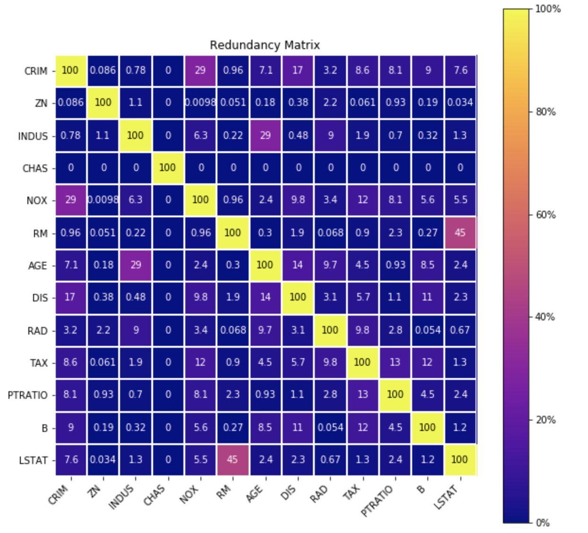
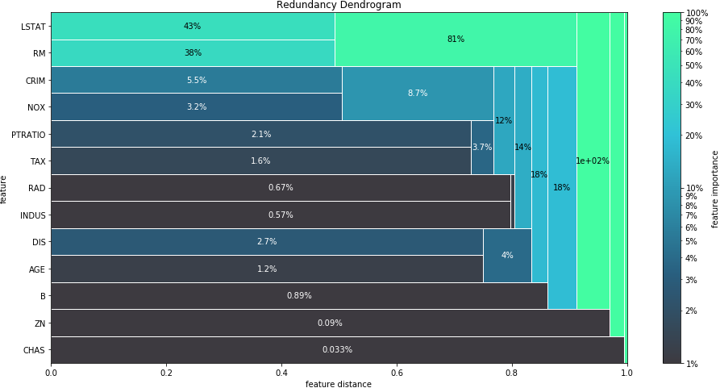
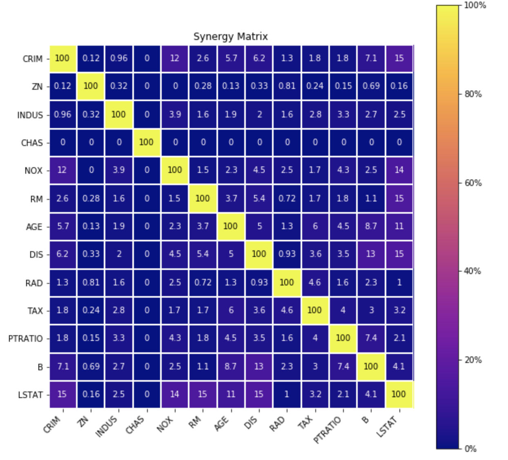
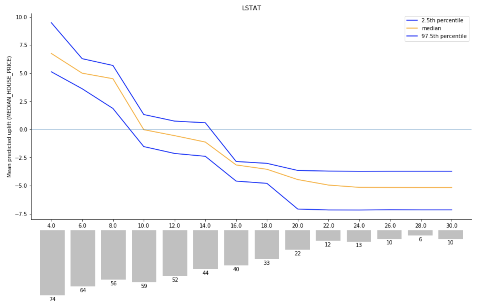
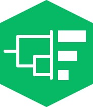

.. image:: _static/facet_banner.png

|

Facet is an open source library for human-explainable AI. It combines sophisticated
model inspection and model-based simulation to enable better explanations of your
supervised machine learning models. Facet is composed of the following key components:

+-------------------+---------------------------------------------------------------------------+
| |pipe|            | **Enhanced Machine Learning Workflow**                                    |
|                   |                                                                           |
|                   | Facet delivers a robust and fail-safe pipelining workflow which allows you|
|                   | to easily impute and select your features as well as ranking a grid of    |
|                   | different models "competing" against each other. Facet introduces         |
|                   | `sklearndf <https://github.com/BCG-Gamma/sklearndf>`_, an augmented       |
|                   | version of `scikit-learn <https://scikit-learn.org/stable/index.html>`_   |
|                   | with enhanced support for `pandas <https://pandas.pydata.org/>`_          |
|                   | dataframes and pipelining.                                                |
|                   |                                                                           |
+-------------------+---------------------------------------------------------------------------+
| |inspect|         | **Model Inspection**                                                      |
|                   |                                                                           |
|                   | Local explanations of features and their interactions make up a key       |
|                   | component of understanding feature importance as well as feature          |
|                   | interactions. This is based on a novel method which decomposes            |
|                   | `SHAP values <https://shap.readthedocs.io/en/latest/>`_ into              |
|                   | two vectors representing **synergy** and **redundancy**.                  |
|                   |                                                                           |
+-------------------+---------------------------------------------------------------------------+
| |sim|             | **Model Simulation**                                                      |
|                   |                                                                           |
|                   | Use your trained model and the insights from the model inspection to      |
|                   | conduct a historical univariate simulation of any feature on your target  |
|                   | in order to identify local optima.                                        |
+-------------------+---------------------------------------------------------------------------+

|azure_pypi| |azure_conda| |azure_devops_master_ci| |code_cov|
|python_versions| |code_style| |made_with_sphinx_doc| |License_badge|

Installation
---------------------

Facet supports both PyPI and Anaconda.

Anaconda
~~~~~~~~~~~~~~~~~~~~~

.. code-block:: RST

    conda install gamma-facet

Pip
~~~~~~~~~~~

.. code-block:: RST

    pip install gamma-facet

Quickstart
----------------------

The following quickstart guide provides a minimal example workflow to get up and running
with Facet.

Enhanced machine learning workflow
~~~~~~~~~~~~~~~~~~~~~~~~~~~~~~~~~~

.. code-block:: Python

    # standard imports
    import pandas as pd
    from sklearn.datasets import load_boston
    from sklearn.model_selection import RepeatedKFold

    # some helpful imports from sklearndf
    from sklearndf.pipeline import RegressorPipelineDF
    from sklearndf.regression import RandomForestRegressorDF

    # relevant FACET imports
    from facet.data import Sample
    from facet.selection import LearnerRanker, LearnerGrid

    # load Boston housing dataset
    boston = load_boston()
    df = pd.DataFrame(data=boston.data, columns=boston.feature_names).assign(
        MEDIAN_HOUSE_PRICE=boston.target
    )

    # create FACET sample object
    boston_obs = Sample(observations=df, target="MEDIAN_HOUSE_PRICE")

    # create pipeline for random forest regressor
    rforest_reg = RegressorPipelineDF(regressor=RandomForestRegressorDF(random_state=42))

    # define grid of models which are "competing" against each other
    rforest_grid = [
        LearnerGrid(
            pipeline=rforest_reg, learner_parameters={"min_samples_leaf": [8, 11, 15]}
        )
    ]

    # create repeated k-fold CV iterator
    rkf_cv = RepeatedKFold(n_splits=5, n_repeats=10, random_state=42)

    # rank your models by performance (default is variance explained)
    ranker = LearnerRanker(grids=rforest_grid, cv=rkf_cv, n_jobs=-3).fit(sample=boston_obs)

    # get summary report
    ranker.summary_report()

.. image:: _static/ranker_summary.png
    :width: 600

Model Inspection
~~~~~~~~~~~~~~~~~~~~~~~~~~~~~

Facet implements several model inspection methods for
`scikit-learn <https://scikit-learn.org/stable/index.html>`_ estimators.
Fundamentally, facet enables post-hoc model inspection by breaking down the interaction
effects of the features used for model training:

- **Redundancy**
  represents how much information is shared between two features contributions to
  the model predictions. For example, temperature and pressure in a pressure cooker are
  redundant features for predicting cooking time since pressure will rise relative to
  the temperature, and vice versa. Therefore, knowing just one of either temperature or
  pressure will likely enable the same predictive accuracy. Redundancy is expressed as
  a percentage ranging from 0% (full uniqueness) to 100% (full redundancy).

- **Synergy**
  represents how much the combined information of two features contributes to
  the model predictions. For example, given features X and Y as
  coordinates on a chess board, the colour of a square can only be predicted when
  considering X and Y in combination. Synergy is expressed as a
  percentage ranging from 0% (full autonomy) to 100% (full synergy).

.. code-block:: Python

    # fit the model inspector
    from facet.inspection import LearnerInspector
    inspector = LearnerInspector()
    inspector.fit(crossfit=ranker.best_model_crossfit_)

    # visualise redundancy as a matrix
    from pytools.viz.matrix import MatrixDrawer
    redundancy_matrix = inspector.feature_redundancy_matrix()
    MatrixDrawer(style="matplot%").draw(redundancy_matrix, title="Redundancy Matrix")

We can also better visualize redundancy as a dendrogram so we can identify clusters of
features with redundancy.

.. code-block:: Python

    # visualise redundancy using a dendrogram
    from pytools.viz.dendrogram import DendrogramDrawer
    redundancy = inspector.feature_redundancy_linkage()
    DendrogramDrawer().draw(data=redundancy, title="Redundancy Dendrogram")

For feature synergy, we can get a similar picture

.. code-block:: Python

    # visualise synergy as a matrix
    synergy_matrix = inspector.feature_synergy_matrix()
    MatrixDrawer(style="matplot%").draw(synergy_matrix, title="Synergy Matrix")

Please see the :ref:`API reference` for more detail.

Model Simulation
~~~~~~~~~~~~~~~~~~

.. code-block:: Python

    # FACET imports
    from facet.validation import BootstrapCV
    from facet.crossfit import LearnerCrossfit
    from facet.simulation import UnivariateUpliftSimulator
    from facet.simulation.partition import ContinuousRangePartitioner
    from facet.simulation.viz import SimulationDrawer

    # create bootstrap CV iterator
    bscv = BootstrapCV(n_splits=1000, random_state=42)

    # create a bootstrap CV crossfit for simulation using best model
    boot_crossfit = LearnerCrossfit(
        pipeline=ranker.best_model_,
        cv=bscv,
        n_jobs=-3,
        verbose=False,
    ).fit(sample=boston_obs)

    SIM_FEAT = "LSTAT"
    simulator = UnivariateUpliftSimulator(crossfit=ranker.best_model_crossfit_, n_jobs=3)

    # split the simulation range into equal sized partitions
    partitioner = ContinuousRangePartitioner()

    # run the simulation
    simulation = simulator.simulate_feature(name=SIM_FEAT, partitioner=partitioner)

    # visualise results
    SimulationDrawer().draw(data=simulation, title=SIM_FEAT)

Download the getting started tutorial and explore Facet for yourself here: |binder|

Contributing
---------------------------

Facet is stable and is being supported long-term.

Contributions to Facet are welcome and appreciated.
For any bug reports or feature requests/enhancements please use the appropriate
`GitHub form <https://github.com/BCG-Gamma/facet/issues>`_, and if you wish to do so,
please open a PR addressing the issue.

We do ask that for any major changes please discuss these with us first via an issue or
at our team email: FacetTeam <at> bcg <dot> com.

For further information on contributing please see our :ref:`contribution-guide`.

License
---------------------------

Facet is licensed under Apache 2.0 as described in the
`LICENSE <https://github.com/BCG-Gamma/facet/LICENSE>`_ file.

Acknowledgements
---------------------------

Facet is built on top of two popular packages for Machine Learning:

The `scikit-learn <https://github.com/scikit-learn/scikit-learn>`_ learners and
pipelining make up implementation of the underlying algorithms. Moreover, we tried
to design the facet API to align with the scikit-learn API.

The `shap <https://github.com/slundberg/shap>`_ implementation is used to estimate the
shapley vectors which are being decomposed into the synergy, redundancy, and
independence vectors.

BCG Gamma
---------------------------

If you would like to know more about the team behind Facet please see our :ref:`about_us` page.

We are always on the lookout for passionate and talented data scientists to join the
BCG Gamma team. If you would like to know more you can find out about BCG Gamma
`here <https://www.bcg.com/en-gb/beyond-consulting/bcg-gamma/default>`_,
or have a look at
`career opportunities <https://www.bcg.com/en-gb/beyond-consulting/bcg-gamma/careers>`_.

.. |pipe| image:: _static/icons/pipe_icon.jpg
    :class: facet_icon

.. |sim| image:: _static/icons/sim_icon.jpg
    :class: facet_icon

.. |azure_conda| image:: https://
    :target: https://
.. |azure_pypi| image:: https://
    :target: https://
.. |azure_devops_master_ci| image:: https://
    :target: https://
.. |code_cov| image:: https://
    :target: https://
.. |python_versions| image:: https://img.shields.io/badge/python-3.7|3.8-blue.svg
    :target: https://www.python.org/downloads/release/python-380/
.. |code_style| image:: https://img.shields.io/badge/code%20style-black-000000.svg
    :target: https://github.com/psf/black
.. |made_with_sphinx_doc| image:: https://img.shields.io/badge/Made%20with-Sphinx-1f425f.svg
    :target: https://www.sphinx-doc.org/
.. |license_badge| image:: https://img.shields.io/badge/License-Apache%202.0-olivegreen.svg
    :target: https://opensource.org/licenses/Apache-2.0
.. |binder| image:: https://mybinder.org/badge_logo.svg
    :target: https://mybinder.org/
