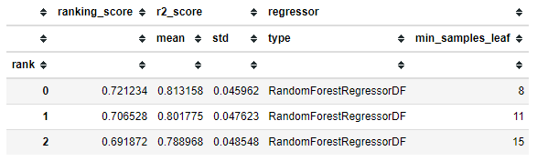
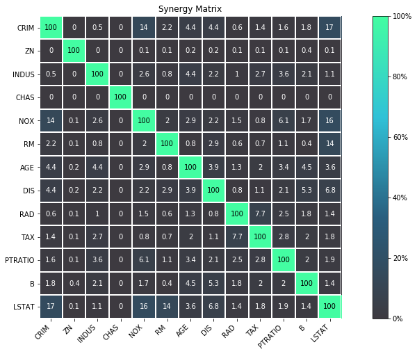
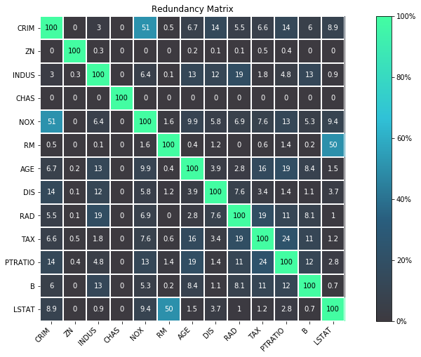
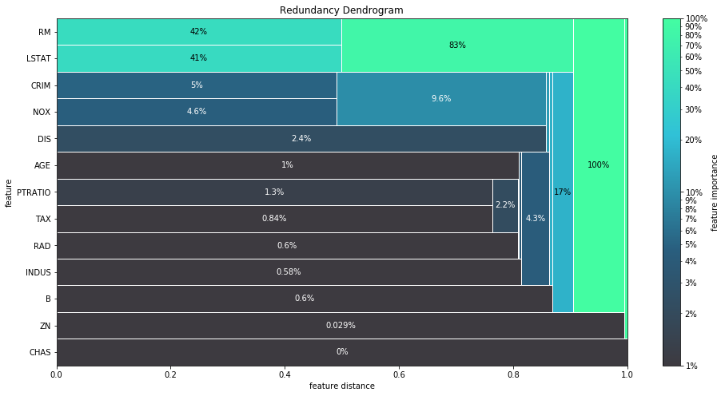
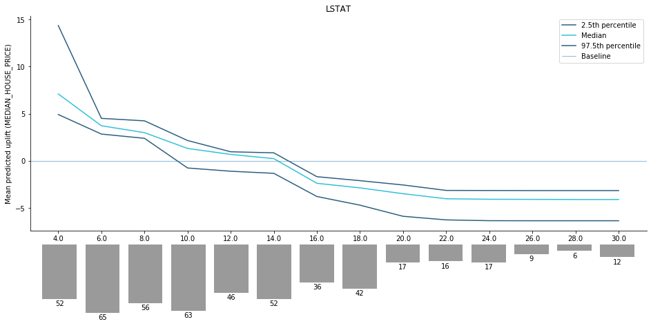

|

FACET is an open source library for human-explainable AI.
It combines sophisticated model inspection and model-based simulation to enable better 
explanations of your supervised machine learning models.

FACET is composed of the following key components:

+-----------------+-----------------------------------------------------------------------+
| |spacer|        | **Model Inspection**                                                  |
|                 |                                                                       |
| |inspect|       | FACET introduces a new algorithm to quantify dependencies and         |
|                 | interactions between features in ML models.                           |
|                 | This new tool for human-explainable AI adds a new, global             |
|                 | perspective to the observation-level explanations provided by the     |
|                 | popular `SHAP <https://shap.readthedocs.io/en/stable/>`__ approach.   |
|                 | To learn more about FACET’s model inspection capabilities, see the    |
|                 | getting started example below.                                        |
+-----------------+-----------------------------------------------------------------------+
| |spacer|        | **Model Simulation**                                                  |
|                 |                                                                       |
| |sim|           | FACET’s model simulation algorithms use ML models for                 |
|                 | *virtual experiments* to help identify scenarios that optimise        |
|                 | predicted outcomes.                                                   |
|                 | To quantify the uncertainty in simulations, FACET utilises a range    |
|                 | of bootstrapping algorithms including stationary and stratified       |
|                 | bootstraps.                                                           |
|                 | For an example of FACET’s bootstrap simulations, see the              |
|                 | quickstart example below.                                             |
+-----------------+-----------------------------------------------------------------------+
| |spacer|        | **Enhanced Machine Learning Workflow**                                |
|                 |                                                                       |
| |pipe|          | FACET offers an efficient and transparent machine learning            |
|                 | workflow, enhancing                                                   |
|                 | `scikit-learn <https://scikit-learn.org/stable/index.html>`__'s       |
|                 | tried and tested pipelining paradigm with new capabilities for model  |
|                 | selection, inspection, and simulation.                                |
|                 | FACET also introduces                                                 |
|                 | `sklearndf <https://github.com/BCG-Gamma/sklearndf>`__                |
|                 | [`documentation <https://bcg-gamma.github.io/sklearndf/index.html>`__]|
|                 | an augmented version of *scikit-learn* with enhanced support for      |
|                 | *pandas* data frames that ensures end-to-end traceability of features.|
+-----------------+-----------------------------------------------------------------------+

.. Begin-Badges

|pypi| |conda| |azure_build| |azure_code_cov|
|python_versions| |code_style| |made_with_sphinx_doc| |License_badge|

.. End-Badges

Installation
------------

FACET supports both PyPI and Anaconda.

Anaconda
~~~~~~~~

.. code-block:: RST

    conda install gamma-facet -c bcg_gamma -c conda-forge

Pip
~~~

.. code-block:: RST

    pip install gamma-facet

Quickstart
----------

The following quickstart guide provides a minimal example workflow to get you
up and running with FACET.
For additional tutorials and the API reference,
see the `FACET documentation <https://bcg-gamma.github.io/facet/>`__.

Changes and additions to new versions are summarized in the
`release notes <https://bcg-gamma.github.io/facet/release_notes.html>`__.

Enhanced Machine Learning Workflow
~~~~~~~~~~~~~~~~~~~~~~~~~~~~~~~~~~

To demonstrate the model inspection capability of FACET, we first create a
pipeline to fit a learner. In this simple example we use the
`diabetes dataset <https://www4.stat.ncsu.edu/~boos/var.select/diabetes.tab.txt>`__
which contains age, sex, BMI and blood pressure along with 6 blood serum
measurements as features. A transformed version of this dataset is also available
on scikit-learn
`here <https://scikit-learn.org/stable/datasets/toy_dataset.html#diabetes-dataset>`__.

In this quickstart we will train a Random Forest regressor using 10 repeated
5-fold CV to predict disease progression after one year. With the use of
*sklearndf* we can create a *pandas* DataFrame compatible workflow. However,
FACET provides additional enhancements to keep track of our feature matrix
and target vector using a sample object (`Sample`) and easily compare
hyperparameter configurations and even multiple learners with the `LearnerRanker`.

.. code-block:: Python

    # standard imports
    import pandas as pd
    from sklearn.model_selection import RepeatedKFold

    # some helpful imports from sklearndf
    from sklearndf.pipeline import RegressorPipelineDF
    from sklearndf.regression import RandomForestRegressorDF

    # relevant FACET imports
    from facet.data import Sample
    from facet.selection import LearnerRanker, LearnerGrid

    # load the diabetes dataset
    diabetes_df = pd.read_csv('diabetes_quickstart.csv')

    # create FACET sample object
    diabetes_sample = Sample(observations=diabetes_df, target_name="Disease_progression")

    # create a (trivial) pipeline for a random forest regressor
    rnd_forest_reg = RegressorPipelineDF(
        regressor=RandomForestRegressorDF(n_estimators=200, random_state=42)
    )

    # define grid of models which are "competing" against each other
    rnd_forest_grid = [
        LearnerGrid(
            pipeline=rnd_forest_reg,
            learner_parameters={
                "min_samples_leaf": [8, 11, 15],
                "max_depth": [4, 5, 6],
            }
        ),
    ]

    # create repeated k-fold CV iterator
    rkf_cv = RepeatedKFold(n_splits=5, n_repeats=10, random_state=42)

    # rank your candidate models by performance (default is mean CV score - 2*SD)
    ranker = LearnerRanker(
        grids=rnd_forest_grid, cv=rkf_cv, n_jobs=-3
    ).fit(sample=diabetes_sample)

    # get summary report
    ranker.summary_report()

We can see based on this minimal workflow that a value of 11 for minimum
samples in the leaf and 5 for maximum tree depth was the best performing
of the three considered values.
This approach easily extends to additional hyperparameters for the learner,
and for multiple learners.

Model Inspection
~~~~~~~~~~~~~~~~

FACET implements several model inspection methods for
`scikit-learn <https://scikit-learn.org/stable/index.html>`__ estimators.
FACET enhances model inspection by providing global metrics that complement
the local perspective of SHAP (see
`[arXiv:2107.12436] <https://arxiv.org/abs/2107.12436>`__ for a formal description).

The key global metrics for each pair of features in a model are:

- **Synergy**

  The degree to which the model combines information from one feature with
  another to predict the target. For example, let's assume we are predicting
  cardiovascular health using age and gender and the fitted model includes
  a complex interaction between them. This means these two features are
  synergistic for predicting cardiovascular health. Further, both features
  are important to the model and removing either one would significantly
  impact performance. Let's assume age brings more information to the joint
  contribution than gender. This asymmetric contribution means the synergy for
  (age, gender) is less than the synergy for (gender, age). To think about it another
  way, imagine the prediction is a coordinate you are trying to reach.
  From your starting point, age gets you much closer to this point than
  gender, however, you need both to get there. Synergy reflects the fact
  that gender gets more help from age (higher synergy from the perspective
  of gender) than age does from gender (lower synergy from the perspective of
  age) to reach the prediction. *This leads to an important point: synergy
  is a naturally asymmetric property of the global information two interacting
  features contribute to the model predictions.* Synergy is expressed as a
  percentage ranging from 0% (full autonomy) to 100% (full synergy).

- **Redundancy**

  The degree to which a feature in a model duplicates the information of a
  second feature to predict the target. For example, let's assume we had
  house size and number of bedrooms for predicting house price. These
  features capture similar information as the more bedrooms the larger
  the house and likely a higher price on average. The redundancy for
  (number of bedrooms, house size) will be greater than the redundancy
  for (house size, number of bedrooms). This is because house size
  "knows" more of what number of bedrooms does for predicting house price
  than vice-versa. Hence, there is greater redundancy from the perspective
  of number of bedrooms. Another way to think about it is removing house
  size will be more detrimental to model performance than removing number
  of bedrooms, as house size can better compensate for the absence of
  number of bedrooms. This also implies that house size would be a more
  important feature than number of bedrooms in the model. *The important
  point here is that like synergy, redundancy is a naturally asymmetric
  property of the global information feature pairs have for predicting
  an outcome.* Redundancy is expressed as a percentage ranging from 0%
  (full uniqueness) to 100% (full redundancy).

.. code-block:: Python

    # fit the model inspector
    from facet.inspection import LearnerInspector
    inspector = LearnerInspector(n_jobs=-3)
    inspector.fit(crossfit=ranker.best_model_crossfit_)

**Synergy**

.. code-block:: Python

    # visualise synergy as a matrix
    from pytools.viz.matrix import MatrixDrawer
    synergy_matrix = inspector.feature_synergy_matrix()
    MatrixDrawer(style="matplot%").draw(synergy_matrix, title="Synergy Matrix")

For any feature pair (A, B), the first feature (A) is the row, and the second
feature (B) the column. For example, looking across the row for `LTG` (Lamotrigine)
there is relatively minimal synergy (≤1%) with other features in the model.
However, looking down the column for `LTG` (i.e., perspective of other features
in a pair with `LTG`) we find many features (the rows) are synergistic (up to 27%)
with `LTG`. We can conclude that:

- `LTG` is a strongly autonomous feature, displaying minimal synergy with other
  features for predicting disease progression after one year.
- The contribution of other features to predicting disease progression after one
  year is partly enabled by the presence of `LTG`.

High synergy between pairs of features must be considered carefully when investigating
impact, as the values of both features jointly determine the outcome. It would not make
much sense to consider `TC` (T-Cells) without the context provided by `LDL` given close
to 27% synergy of `LDL` with `LTG` for predicting progression after one year.

**Redundancy**

.. code-block:: Python

    # visualise redundancy as a matrix
    redundancy_matrix = inspector.feature_redundancy_matrix()
    MatrixDrawer(style="matplot%").draw(redundancy_matrix, title="Redundancy Matrix")

For any feature pair (A, B), the first feature (A) is the row, and the second feature
(B) the column. For example, if we look at the feature pair (`LDL`, `TC`) from the
perspective of `LDL` (Low-Density Lipoproteins), then we look-up the row for `LDL`
and the column for `TC` and find 38% redundancy. This means that 38% of the information
in `LDL` is duplicated with `TC` to predict disease progression after one year. This
redundancy is the same when looking "from the perspective" of `TC` for (`TC`, `LDL`),
but need not be symmetrical in all cases (see `LTG` vs. `TSH`).

If we look at `TSH`, it has between 22–32% redundancy each with `LTG` and `HDL`, but
the same does not hold between `LTG` and `HDL` – meaning `TSH` shares different
information with each of the two features.

**Clustering redundancy**

As detailed above redundancy and synergy for a feature pair is from the
"perspective" of one of the features in the pair, and so yields two distinct
values. However, a symmetric version can also be computed that provides not
only a simplified perspective but allows the use of (1 - metric) as a
feature distance. With this distance hierarchical, single linkage clustering
is applied to create a dendrogram visualization. This helps to identify
groups of low distance, features which activate "in tandem" to predict the
outcome. Such information can then be used to either reduce clusters of
highly redundant features to a subset or highlight clusters of highly
synergistic features that should always be considered together.

Let's look at the example for redundancy.

.. code-block:: Python

    # visualise redundancy using a dendrogram
    from pytools.viz.dendrogram import DendrogramDrawer
    redundancy = inspector.feature_redundancy_linkage()
    DendrogramDrawer().draw(data=redundancy, title="Redundancy Dendrogram")

Based on the dendrogram we can see that the feature pairs (`LDL`, `TC`)
and (`HDL`, `TSH`) each represent a cluster in the dendrogram and that `LTG` and `BMI`
have the highest importance. As potential next actions we could explore the impact of
removing `TSH`, and one of `TC` or `LDL` to further simplify the model and obtain a
reduced set of independent features.

Please see the
`API reference <https://bcg-gamma.github.io/facet/apidoc/facet.html>`__
for more detail.

Model Simulation
~~~~~~~~~~~~~~~~

Taking the `BMI` feature as an example of an important and highly independent feature,
we do the following for the simulation:

- We use FACET's `ContinuousRangePartitioner` to split the range of observed values of
  `BMI` into intervals of equal size. Each partition is represented by the central value
  of that partition.
- For each partition, the simulator creates an artificial copy of the original sample
  assuming the variable to be simulated has the same value across all observations –
  which is the value representing the partition. Using the best `LearnerCrossfit`
  acquired from the ranker, the simulator now re-predicts all targets using the models
  trained for all folds and determines the average uplift of the target variable
  resulting from this.
- The FACET `SimulationDrawer` allows us to visualise the result; both in a
  *matplotlib* and a plain-text style.

Finally, because FACET can use bootstrap cross validation, we can create a crossfit
from our previous `LearnerRanker` best model to perform the simulation, so we can
quantify the uncertainty by using bootstrap confidence intervals.

.. code-block:: Python

    # FACET imports
    from facet.validation import BootstrapCV
    from facet.crossfit import LearnerCrossfit
    from facet.simulation import UnivariateUpliftSimulator
    from facet.data.partition import ContinuousRangePartitioner
    from facet.simulation.viz import SimulationDrawer

    # create bootstrap CV iterator
    bscv = BootstrapCV(n_splits=1000, random_state=42)

    # create a bootstrap CV crossfit for simulation using best model
    boot_crossfit = LearnerCrossfit(
        pipeline=ranker.best_model_,
        cv=bscv,
        n_jobs=-3,
        verbose=False,
    ).fit(sample=diabetes_sample)

    SIM_FEAT = "BMI"
    simulator = UnivariateUpliftSimulator(crossfit=boot_crossfit, n_jobs=-3)

    # split the simulation range into equal sized partitions
    partitioner = ContinuousRangePartitioner()

    # run the simulation
    simulation = simulator.simulate_feature(feature_name=SIM_FEAT, partitioner=partitioner)

    # visualise results
    SimulationDrawer().draw(data=simulation, title=SIM_FEAT)

We would conclude from the figure that higher values of `BMI` are associated with
an increase in disease progression after one year, and that for a `BMI` of 29
and above, there is a significant increase in disease progression after one year
of at least 26 points.

Contributing
------------

FACET is stable and is being supported long-term.

Contributions to FACET are welcome and appreciated.
For any bug reports or feature requests/enhancements please use the appropriate
`GitHub form <https://github.com/BCG-Gamma/facet/issues>`_, and if you wish to do so,
please open a PR addressing the issue.

We do ask that for any major changes please discuss these with us first via an issue or
using our team email: FacetTeam@bcg.com.

For further information on contributing please see our
`contribution guide <https://bcg-gamma.github.io/facet/contribution_guide.html>`__.

License
-------

FACET is licensed under Apache 2.0 as described in the
`LICENSE <https://github.com/BCG-Gamma/facet/blob/develop/LICENSE>`_ file.

Acknowledgements
----------------

FACET is built on top of two popular packages for Machine Learning:

-   The `scikit-learn <https://scikit-learn.org/stable/index.html>`__ learners and
    pipelining make up implementation of the underlying algorithms. Moreover, we tried
    to design the FACET API to align with the scikit-learn API.
-   The `SHAP <https://shap.readthedocs.io/en/latest/>`__ implementation is used to
    estimate the shapley vectors which FACET then decomposes into synergy, redundancy,
    and independence vectors.

BCG GAMMA
---------

If you would like to know more about the team behind FACET please see the
`about us <https://bcg-gamma.github.io/facet/about_us.html>`__ page.

We are always on the lookout for passionate and talented data scientists to join the
BCG GAMMA team. If you would like to know more you can find out about
`BCG GAMMA <https://www.bcg.com/en-gb/beyond-consulting/bcg-gamma/default>`_,
or have a look at
`career opportunities <https://www.bcg.com/en-gb/beyond-consulting/bcg-gamma/careers>`_.

.. |pipe| image:: sphinx/source/_static/icons/pipe_icon.png
   :width: 100px
   :class: facet_icon

.. |inspect| image:: sphinx/source/_static/icons/inspect_icon.png
   :width: 100px
   :class: facet_icon

.. |sim| image:: sphinx/source/_static/icons/sim_icon.png
   :width: 100px
   :class: facet_icon

.. |spacer| unicode:: 0x2003 0x2003 0x2003 0x2003 0x2003 0x2003

.. Begin-Badges

.. |conda| image:: https://anaconda.org/bcg_gamma/gamma-facet/badges/version.svg
    :target: https://anaconda.org/BCG_Gamma/gamma-facet

.. |pypi| image:: https://badge.fury.io/py/gamma-facet.svg
    :target: https://pypi.org/project/gamma-facet/

.. |azure_build| image:: https://dev.azure.com/gamma-facet/facet/_apis/build/status/BCG-Gamma.facet?repoName=BCG-Gamma%2Ffacet&branchName=develop
   :target: https://dev.azure.com/gamma-facet/facet/_build?definitionId=7&_a=summary

.. |azure_code_cov| image:: https://img.shields.io/azure-devops/coverage/gamma-facet/facet/7/develop.svg
   :target: https://dev.azure.com/gamma-facet/facet/_build?definitionId=7&_a=summary

.. |python_versions| image:: https://img.shields.io/badge/python-3.6|3.7|3.8-blue.svg
   :target: https://www.python.org/downloads/release/python-380/

.. |code_style| image:: https://img.shields.io/badge/code%20style-black-000000.svg
   :target: https://github.com/psf/black

.. |made_with_sphinx_doc| image:: https://img.shields.io/badge/Made%20with-Sphinx-1f425f.svg
   :target: https://bcg-gamma.github.io/facet/index.html

.. |license_badge| image:: https://img.shields.io/badge/License-Apache%202.0-olivegreen.svg
   :target: https://opensource.org/licenses/Apache-2.0

.. End-Badges