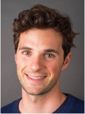
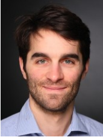
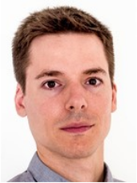

.. _about_us:

About us
===========

.. raw:: html

    

    Hi there, we are the FACET team! We are part of BCG Gamma, a global team of
    data scientists working in industry who love what we do.
    

Our Story
----------

Industry standard packages for machine learning (scikit-learn) and model inspection
(shap) are critical for best practice Data Science. However, combining these into
an efficient and reproducible process that yields deep insights for industrial and
business processes can be challenging and time consuming. We found this to be a common
challenge for our global data science teams across 100s of projects every year.

So what did we envision to solve this problem? Well, an easy way to create a robust
pipeline for learner selection with cross-validation, advanced model inspection to
deeply understand feature contributions to predictions, and the ability to use simulation
to gain insight into optimal feature values. At the same time we wanted to build from
the industry standard eco-system (i.e., scikit-learn, shap) not re-invent it.

So we got a bunch of data scientists look at the problem from every angle and well you
get FACET! Little geometry humour there, we apologise. FACET implements a newly
developed algorithm to explain how variables of a
predictive model collaborate to predict outcomes by identifying patterns across the
explanations of many individual predictions. This advanced model inspection allows
strong independent factors to be identified and then explored via simulation to
understand optimal values for the predictive target of interest.

Our Team
----------

Of course, open-sourcing FACET would not have been possible without the support,
contributions and perspectives of many fantastic people! FACET, many perspectives,
okay that was the last geometry pun we promise.

**FACET Team at BCG Gamma**

+-------------------+-------------------+-------------------+-------------------+
| |JasonB|          | |MaloG|           | |KonstantinH|     | |JanI|            |
| Jason Bentley     | Malo Grisard      | Konstantin Hemker | Jan Ittner        |
+-------------------+-------------------+-------------------+-------------------+
| |RicardoK|        | |FlorentM|        | |JoergS|          |                   |
| Ricardo Kennedy   | Florent Martin    | Joerg Schneider   |                   |
+-------------------+-------------------+-------------------+-------------------+
+-------------------+-------------------+-------------------+-------------------+

